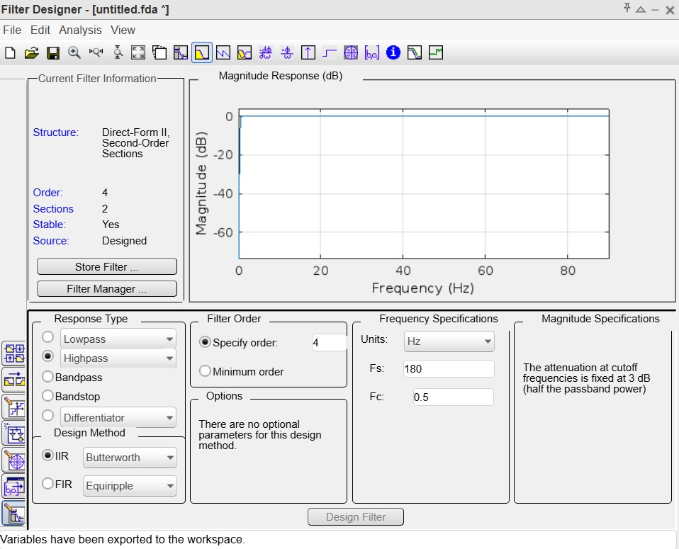
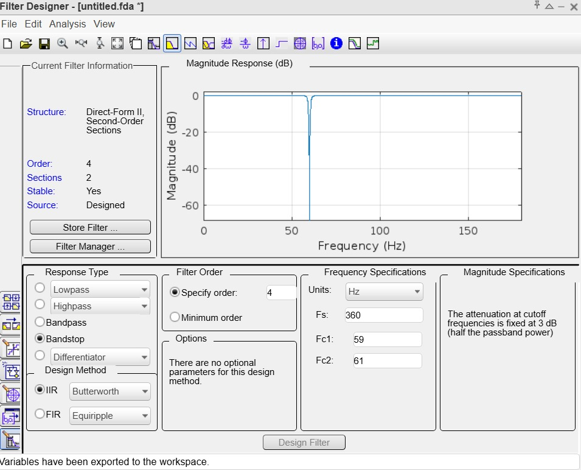
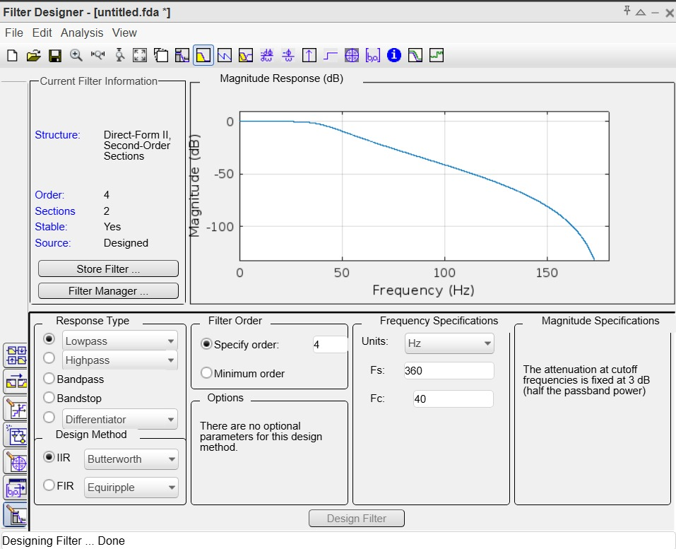
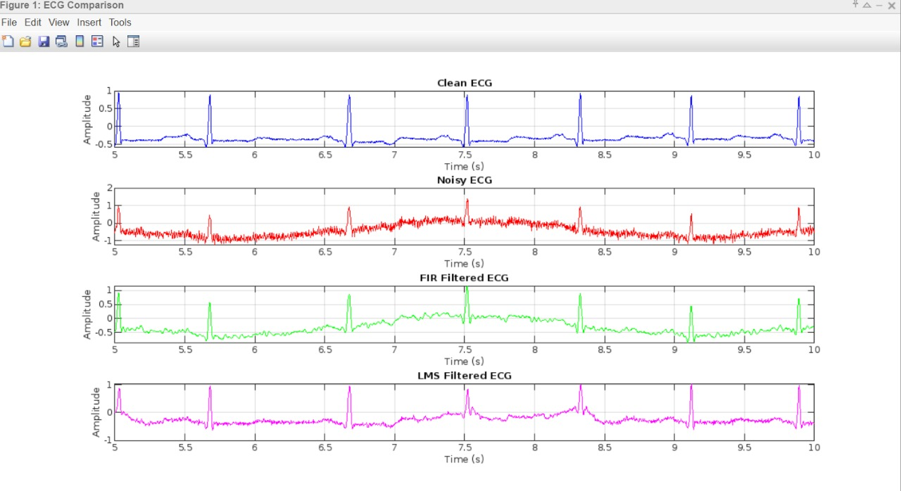
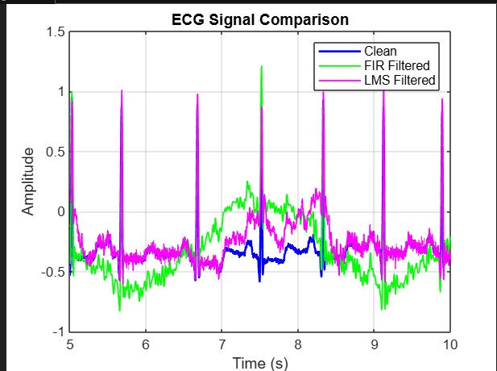
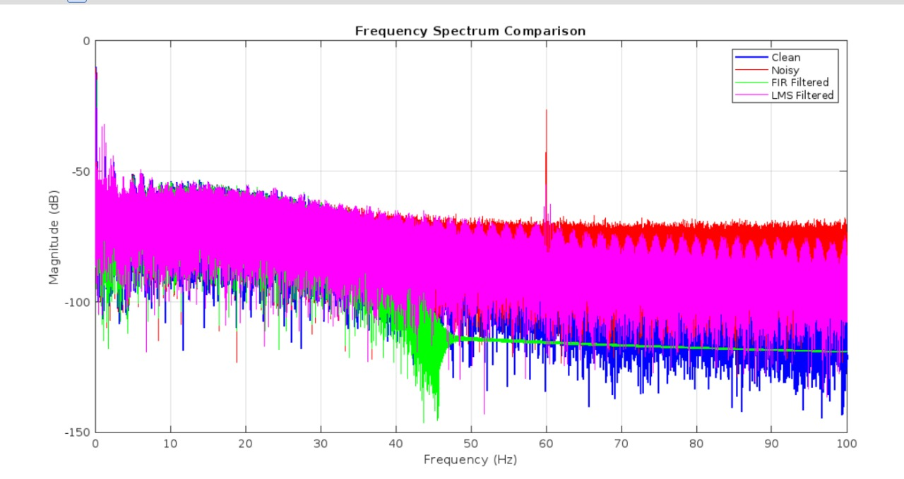
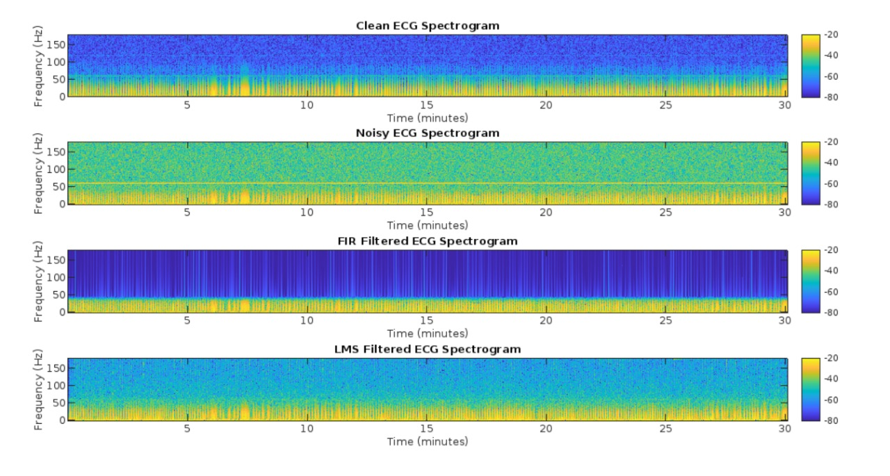

# ECG Signal Denoising using Classical and Adaptive Filtering 
---

## 1. Project Overview

This project implements and compares multiple **Digital Signal Processing (DSP)** techniques for removing noise from real ECG (electrocardiogram) recordings while preserving diagnostically important morphology (P-QRS-T waves, especially the QRS complex).

Three noise-removal strategies are implemented and evaluated:

1. **IIR (Butterworth) Filtering** — a cascade of a notch filter, a high-pass filter, and a low-pass filter.
2. **LMS Adaptive Filtering** — an adaptive filter that updates its coefficients using the Least Mean Squares algorithm.
3. **NLMS Adaptive Filtering** — a normalized variant of LMS with a step size that self-adjusts based on input signal energy (implemented and discussed in the written report; see [Section 6]

The signals are synthetically corrupted with three realistic ECG noise sources (powerline interference, baseline wander, and EMG/muscle noise), filtered using each method, and then evaluated quantitatively (SNR, RMSE) and visually (time-domain plots, FFT spectra, spectrograms).

---

## 2. Repository Contents

| File | Description |
|---|---|
| [`project.m`](project.m) | Main, most developed MATLAB script. Loads a real ECG CSV (MIT-BIH style record `100.csv`), simulates noise, applies IIR (notch + high-pass + low-pass Butterworth) filtering **and** an LMS adaptive filter (via `dsp.LMSFilter`), computes SNR/RMSE metrics, and produces time-domain, frequency-domain, and spectrogram visualizations. |
| [`project1.m`](project1.m) | Earlier/alternate script variant. Loads ECG data from a `.mat` file (SimEMG database), simulates noise, and designs filters interactively using MATLAB's **Filter Design & Analysis Tool (`fdatool`)** combined with `designfilt`. Also includes a naive real-time / moving-window filtering simulation. |
| `WhatsApp Image 2026-08-17 at 4.06.01 PM*.jpeg` | Screenshots of the MATLAB **Filter Designer (FDA Tool)** app showing the design of the high-pass (0.5 Hz cutoff, order 4, Fs = 180 Hz), band-stop/notch (59–61 Hz, order 4, Fs = 360 Hz), and low-pass (40 Hz cutoff, order 4, Fs = 360 Hz) IIR filters and their magnitude responses. |
| `WhatsApp Image 2026-08-17 at 4.10.18 PM*.jpeg`, `4.10.19 PM*.jpeg` | Output result screenshots: overlaid ECG comparison plot (Clean vs. FIR/IIR Filtered vs. LMS Filtered), the stacked 4-subplot time-domain comparison, the 4-panel spectrogram comparison, and the frequency-spectrum (FFT) comparison plot. |

> **Note:** There is no source-controlled dataset in this repository. Both scripts reference **external, hard-coded local file paths** (see [Section 8 — Known Issues](#8-known-issues--limitations)) that must be updated to run the code on a new machine.

---

## 3. Problem Motivation

Raw ECG signals acquired from electrodes are rarely clean. They are typically corrupted by:

- **Powerline interference (PLI):** 50/60 Hz sinusoidal interference coupled from AC mains.
- **Baseline wander:** Low-frequency drift (< 1 Hz) caused by patient respiration, movement, or poor electrode contact.
- **EMG / muscle noise:** Broadband, high-frequency random noise from muscle activity near the electrodes.

These artifacts can obscure the clinically significant **QRS complex**, **P-wave**, and **T-wave**, making automated diagnosis (arrhythmia detection, heart-rate estimation, etc.) unreliable. The goal of this project is to suppress these specific noise sources with minimal distortion to the true ECG morphology.

---

## 4. Methodology (Pipeline)

The processing pipeline implemented in [`project.m`](project.m) — the primary script — is as follows:

```
CSV (100.csv: time_ms, MLII lead)
        │
        ▼
Extract clean ECG signal + estimate sampling frequency (fs)
        │
        ▼
Synthetically inject noise:
   • Powerline: 0.1·sin(2π·60·t)
   • Baseline drift: 0.5·sin(2π·0.3·t)
   • EMG noise: 0.1·randn(size(t))
        │
        ├────────────► IIR Filter Chain ────────────► ecg_filt
        │              (Notch → High-pass → Low-pass, filtfilt)
        │
        └────────────► LMS Adaptive Filter ──────────► ecg_filtered_lms
                       (dsp.LMSFilter, order 128, μ = 0.01)
        │
        ▼
Compute SNR (before/after) and RMSE for each method
        │
        ▼
Visualize: time-domain subplots, overlay plot, FFT spectra, spectrograms
```

### 4.1 Signal Acquisition

- Source: `100.csv` — a CSV export of an ECG record (columns `time_ms` and `MLII`, consistent with the **MIT-BIH Arrhythmia Database** naming convention, lead II).
- Time vector converted from milliseconds to seconds.
- Sampling frequency `fs` is **auto-detected** from the time vector: `fs = round(1/mean(diff(t)))`.

### 4.2 Noise Simulation

Three additive noise components are synthesized and summed onto the clean signal:

| Noise Source | Model | Amplitude |
|---|---|---|
| Powerline interference | `0.1 * sin(2π·60·t)` | 0.1 |
| Baseline wander | `0.5 * sin(2π·0.3·t)` | 0.5 |
| EMG / muscle noise | `0.1 * randn(size(t))` (Gaussian white noise) | 0.1 σ |

`ecg_noisy = ecg_clean + powerline_noise + baseline_drift + emg_noise`

### 4.3 IIR Filter Design (Butterworth)

Three cascaded zero-phase IIR filters are applied in sequence using `filtfilt` (zero-phase, non-causal filtering to avoid phase distortion):

1. **Notch filter (powerline removal):** Designed with `iirnotch(wo, bw)` where `wo = 60/(fs/2)` is the normalized 60 Hz notch frequency and `bw = wo/35` sets the notch bandwidth/sharpness.
2. **High-pass Butterworth filter (baseline wander removal):** `butter(4, 0.5/(fs/2), 'high')` — 4th-order, 0.5 Hz cutoff.
3. **Low-pass Butterworth filter (EMG/high-frequency noise removal):** `butter(6, 40/(fs/2), 'low')` — 6th-order, 40 Hz cutoff.

Application order: **Notch → High-pass → Low-pass.**

In [`project1.m`](project1.m), the equivalent filters are instead designed **interactively via `fdatool`** (MATLAB's Filter Designer GUI) and generated programmatically with `designfilt`:
- Band-stop IIR notch: order 2, 49–51 Hz half-power frequencies, Fs = 360 Hz (screenshot: `4.06.01 PM (1)`).
- High-pass IIR: order 4, 0.5 Hz cutoff, Fs = 180 Hz (screenshot: `4.06.01 PM`).
- Low-pass IIR: order 4, 40/50 Hz cutoff, Fs = 360 Hz (screenshot: `4.06.01 PM (2)`).

These are applied causally with `filter()` rather than `filtfilt()`, and combined sequentially: **Notch → High-pass → Low-pass.**




### 4.4 LMS Adaptive Filtering

- Implemented using MATLAB's built-in `dsp.LMSFilter` System object.
- **Filter length (order):** `M = 128` taps.
- **Step size:** `μ = 0.01`.
- **Reference (desired) signal:** the clean ECG signal.
- **Input:** the noisy ECG signal.
- The adaptive filter iteratively updates its 128 filter weights each sample to minimize the mean-squared error between its output and the clean reference, converging toward a filter that "undoes" the added noise.

### 4.5 Performance Metrics

Two standard metrics are computed for each stage of the pipeline (noisy, IIR-filtered, LMS-filtered):

- **SNR (Signal-to-Noise Ratio, dB)** via MATLAB's `snr()` function — comparing the clean signal against the residual error.
  - `snr_before`, `snr_after` (IIR), `snr_after_lms`
  - `SNR improvement = snr_after - snr_before`
- **RMSE (Root Mean Square Error)** — `sqrt(mean((ecg_clean - x).^2))` for the noisy, IIR-filtered, and LMS-filtered signals.

### 4.6 Visualization Suite

`project.m` generates four categories of plots (see screenshots in the repo for representative examples):

1. **Stacked time-domain comparison** (4 subplots): Clean, Noisy, IIR Filtered, LMS Filtered — zoomed to a 5–10 second window.
2. **Overlay comparison plot:** Clean vs. IIR Filtered vs. LMS Filtered on a single axis for direct visual comparison.
3. **Frequency-domain (FFT) comparison:** Magnitude spectra (dB, normalized) of all four signal variants, computed via zero-padded FFT (`nextpow2`), plotted from 0–100 Hz.
4. **Spectrogram comparison** (4 subplots): Short-time Fourier spectrograms (window = 256, overlap = 250, `yaxis` orientation) for Clean, Noisy, IIR Filtered, and LMS Filtered signals, with a shared color scale (`clim([-80 -20])`) to visually compare noise-energy suppression over time.

---






## 5. Alternate Script: `project1.m`

`project1.m` is a self-contained, earlier variant of the pipeline with a few distinct features not present in `project.m`:

- Loads ECG data from a **`.mat` file** from the *"SimEMG database — simultaneous recordings of noise-free and noise-contaminated ECG signals"* dataset, rather than a CSV.
- Uses a **fixed sampling frequency of 360 Hz** rather than auto-detecting it.
- Opens MATLAB's **`fdatool`** GUI directly within the script for interactive filter design.
- Simulates noise at slightly different parameters (50 Hz powerline instead of 60 Hz, amplitude 0.5; 0.5 Hz baseline wander instead of 0.3 Hz).
- Includes a rudimentary **"real-time" simulation** using a sliding/moving window (`window_size = 500`) that re-applies the low-pass filter to each window independently — an illustrative (not production-grade) approach to streaming/online filtering.
- Does **not** include an LMS or NLMS adaptive filter — it only demonstrates the classical IIR chain.

---

## 6. NLMS (Normalized LMS) Filter 

```matlab
mu_nlms = 0.01;
order_nlms = 128;
epsilon = 1e-6;
ecg_filtered_nlms = zeros(size(ecg_noisy));
W_nlms = zeros(order_nlms,1);
buffer_nlms = zeros(order_nlms,1);

for i = order_nlms:length(ecg_noisy)
    buffer_nlms = [ecg_noisy(i); buffer_nlms(1:end-1)];
    y_nlms = W_nlms' * buffer_nlms;
    e_nlms = ecg_clean(i) - y_nlms;
    norm_factor = epsilon + buffer_nlms' * buffer_nlms;
    W_nlms = W_nlms + (mu_nlms / norm_factor) * e_nlms * buffer_nlms;
    ecg_filtered_nlms(i) = y_nlms;
end
```

**How it differs from standard LMS:** NLMS normalizes the adaptation step size by the instantaneous energy of the input buffer (`epsilon + buffer_nlms' * buffer_nlms`), which improves convergence stability and speed when the input signal's power varies over time (non-stationary noise) — a common characteristic of biomedical signals like ECG.

Conclusion, **NLMS achieved the best SNR improvement and RMSE reduction** of the three methods tested, making it the top performer for this task.

---

## 7. Results Summary

### 7.1 Quantitative Metrics

Both scripts print the following metrics to the console (exact numeric values depend on the noise realization/random seed and are not fixed in the source — run the scripts to reproduce them):

- `SNR before filtering` (dB)
- `SNR after filtering` (IIR, dB)
- `SNR improvement` (dB)
- `SNR after LMS filtering` (dB)
- `SNR after NLMS filtering` (dB) 
- RMSE before filtering, after IIR filtering, after LMS filtering, and after NLMS filtering 

### 7.2 Qualitative / Visual Results

Representative output figures (captured as screenshots in this repository) include:

- **Filter magnitude responses** designed in `fdatool`:
  - High-pass filter, 0.5 Hz cutoff, order 4 (baseline wander removal)
  - Band-stop/notch filter, 59–61 Hz, order 4 (powerline interference removal)
  - Low-pass filter, 40 Hz cutoff, order 4 (EMG noise removal)
- **Time-domain comparison** — 4-panel stacked plot: Clean / Noisy / IIR (labeled "FIR" in one screenshot) Filtered / LMS Filtered, all clearly showing preserved QRS peaks after filtering.
- **Overlay plot** — Clean, IIR Filtered, and LMS Filtered signals superimposed over a 5–10 s window, showing the IIR filter tracks the clean baseline more tightly while LMS retains more residual variance for this configuration.
- **Frequency spectrum comparison** — FFT magnitude (dB) from 0–100 Hz, clearly showing a large 60 Hz spike in the noisy signal that is fully attenuated in the IIR-filtered result.
- **Spectrogram comparison** (4-panel, over a ~30 minute record) — visually demonstrates that the noisy signal has a persistent horizontal band of powerline energy around 60 Hz across the entire recording, which is largely absent from the IIR-filtered spectrogram.

### 7.3 Conclusions

- **IIR filtering** provided a strong, low-complexity baseline by removing known, fixed frequency bands (powerline, baseline wander, high-frequency noise).
- **LMS adaptive filtering** dynamically tracked variations in the noise, offering modest improvements over the static IIR filter in some respects.
- **NLMS filtering** achieved the best overall SNR improvement and RMSE reduction of the three approaches due to its self-normalizing step size, making it best suited to non-stationary, real-time biomedical signal environments.
- Visual inspection confirmed that QRS complex morphology was preserved across all filtering methods, supporting the diagnostic validity of the filtered outputs.
- The approach is proposed as a foundation for **portable/wearable ECG monitoring systems** operating under variable real-world noise conditions.

---

## 8. Known Issues / Limitations

- **Hard-coded absolute file paths:** Both scripts reference local machine paths (`C:\Users\Hashir\Downloads\100.csv` in `project.m`, `D:/soft/Matlab/SimEMG database.../P1_1_Ag-AgCl.mat` in `project1.m`) that will not exist on another machine. These must be edited before running.
- **No source dataset included:** The ECG CSV/`.mat` data files referenced by the scripts are not included in this repository.
- **Synthetic (not real) noise:** All noise (powerline, baseline wander, EMG) is artificially generated and added to a clean recording rather than sourced from real-world noisy ECG acquisition, which somewhat idealizes the filtering problem.
- **`project1.m` real-time simulation is a placeholder:** the moving-window loop reassigns a scalar via `filter()` per index in a way that is illustrative rather than a correct streaming/online-filter implementation (state is not carried between windows), and `fdatool` requires manual interaction, which blocks unattended/batch execution.
- **Zero-phase vs. causal filtering:** `project.m` uses `filtfilt` (non-causal, offline-only), whereas `project1.m` uses `filter` (causal, real-time-capable) — the two scripts are not directly equivalent and represent different design trade-offs (phase distortion vs. real-time feasibility).

---

## 9. Requirements

- **MATLAB** (developed/tested with a version supporting `dsp.LMSFilter`, `designfilt`, `filtfilt`, `spectrogram`, and `fdatool`).
- **Toolboxes:**
  - Signal Processing Toolbox (`butter`, `iirnotch`, `filtfilt`, `designfilt`, `spectrogram`, `snr`)
  - DSP System Toolbox (`dsp.LMSFilter`, `fdatool`)
- Input ECG data:
  - `project.m` expects a CSV with `time_ms` and `MLII` columns.
  - `project1.m` expects a `.mat` file containing a variable (referenced as `ecg_signal` in the script — this must match the actual variable name inside the `.mat` file, e.g. from the SimEMG database).

## 10. How to Run

1. Open MATLAB and set the working directory to this project folder.
2. Edit the hard-coded file path at the top of the script you want to run:
   - `project.m`: update `filename` to point to your local `100.csv` (or equivalent MIT-BIH-format CSV export).
   - `project1.m`: update `data_file` to point to your local `.mat` ECG file, and confirm the actual signal variable name matches `ecg_signal`.
3. Run the script (`F5` or `Run` in the MATLAB Editor).
4. `project.m` will print SNR/RMSE metrics to the console and open several figure windows (time-domain, overlay, FFT spectrum, spectrograms).
5. `project1.m` will additionally launch the interactive `fdatool` GUI — filters must be reviewed/exported there for the script's `designfilt`-based filters to be used as intended.
